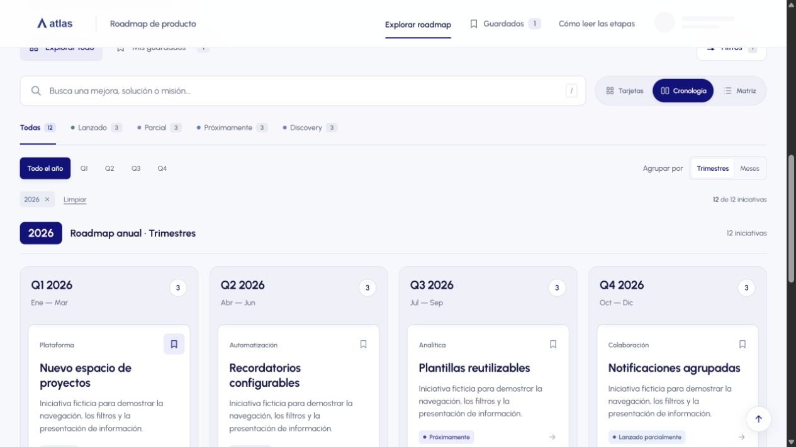

# Roadmap Studio

Explorador de iniciativas de producto con filtros, vistas por trimestre, búsqueda, guardados y transiciones accesibles.



**[Abrir demo](https://lquevedo-oss.github.io/roadmap-studio/)**

## Probar localmente

```bash
python build.py
python -m http.server 8080 --bind 127.0.0.1
```

Abre http://localhost:8080. También puedes abrir `index.html` directamente.

## Funciones

- Filtros por país, solución, año, trimestre, etapa e iniciativas con IA.
- Búsqueda, vistas de tarjetas y columnas, detalle y enlaces de estado compartibles.
- Guardados en el navegador, navegación por teclado y respeto a movimiento reducido.
- Menú de perfil de muestra; la demo no inicia sesiones reales.

## Alcance público

Adaptación demostrativa de un trabajo de interfaz. La marca Atlas, su ilustración y todas las iniciativas son ficticias. Se reemplazaron completamente el dataset, las referencias internas, las imágenes originales y los identificadores de trabajo. No describe planes de una empresa.

El proyecto original también incluyó limpieza y sincronización de datos; esta edición pública se concentra en la interfaz. Ver [Automation Lab](https://github.com/lquevedo-oss/automation-lab) para ejemplos de procesamiento.

## Autoría y recursos

Luka: definición del problema, dirección de interfaz, prioridades y revisión; desarrollo asistido por IA. Urbanist conserva su licencia OFL en `brand/OFL.txt`. Parte de las recetas de movimiento se adaptó de snippets de Transitions.dev; se conserva la referencia en el código.
